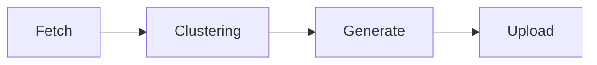

# Syrup and Srimp News
In today’s information environment, access to international news is often shaped by media bias and one-sided narratives. Public understanding of global affairs is also frequently constrained by information overload and limited source diversity. To address this challenge, we plan to build an AI-powered news aggregation platform. The platform will systematically collect news content from a wide range of sources worldwide and use intelligent analysis and fact-checking to reduce bias and perspective-driven storytelling. It will integrate and present information in an objective, data-driven manner. Our goal is to provide a trustworthy and neutral news perspective that helps readers gain a more comprehensive understanding of international events, while strengthening media literacy and critical thinking.

## Logic of Operation
We first crawl trending news from major news websites. Next, we use **nomic-embed-text** to embed and cluster all articles. Then, we feed the clustered results into **qwen3-vl:8b** to generate a new, objective and neutral synthesized article. Finally, we upload the generated content to our news platform.

